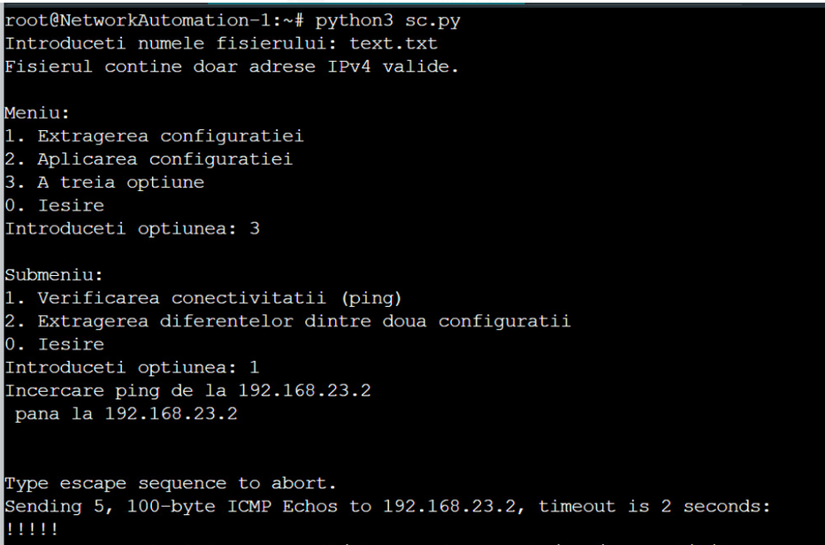

# Python-in-telecom

A request is made for an application to configure/extract configuration from user-selected IP addresses in the network, according to the following activity diagram of the application.
The application should fulfill the following functionalities:

-Validated input of the IP address file (file validation, content validation)

-Menu with the following two options:

    -Extraction of configuration of all validated equipment from the file into a file named hostname.txt
    
    -Application of the configuration from a file entered by the user to the validated equipment from the IP address file.

-A submenu with two options, connectivity verification (ping), and extraction of differences between two configurations.     

The project is done and tested in GNS3.    

